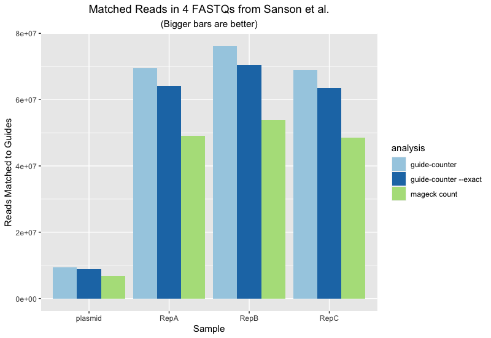
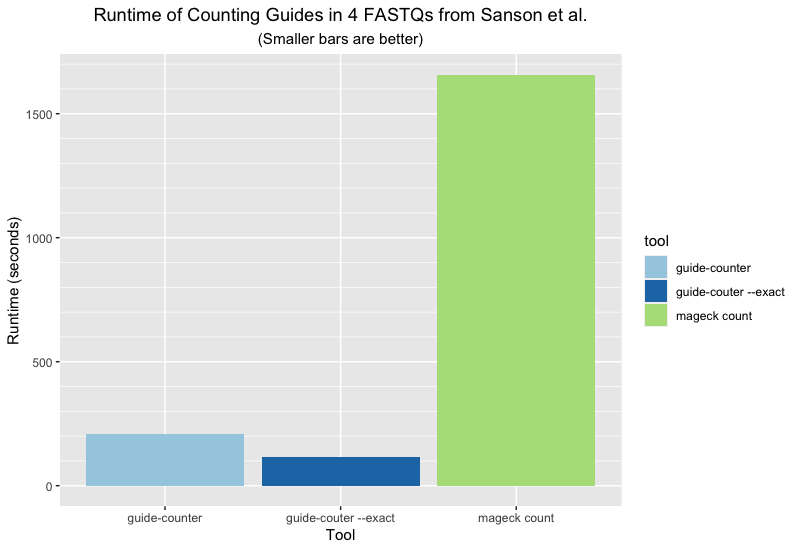

# guide-counter


<p align="center">
  <a href="https://github.com/fulcrumgenomics/guide-counter/actions?query=workflow%3ACheck"></a>
  <a href="https://crates.io/crates/guide-counter"></a>
  <a href="http://bioconda.github.io/recipes/guide-counter/README.html"></a>
  <a href="https://doi.org/10.5281/zenodo.6375791"></a>
  <br>
</p>

A better, faster way to count guides in CRISPR screens.

<p>
<a href float="left"="https://fulcrumgenomics.com"></a>
</p>

[Visit us at Fulcrum Genomics](www.fulcrumgenomics.com) to learn more about how we can power your Bioinformatics with guide-counter and beyond.

<a href="mailto:contact@fulcrumgenomics.com?subject=[GitHub inquiry]"></a>
<a href="https://www.fulcrumgenomics.com"></a>

## Overview

`guide-counter` is a tool for processing FASTQ files from CRISPR screen experiments to generate a matrix of per-sample guide counts.  It can be used as a faster, more accurate, drop in replacement for `mageck count`.  By default `guide-counter` will look for guide seqeunces in the reads with 0 or 1 mismatches vs. the expected guides, but can be run in exact matching mode.

## Why `guide-counter`?

If you have any experience analyzing CRISPR screens you've almost certainly tried [`mageck`][mageck-link].  It's widely used, highly cited and generally works well.  Surprisingly though, `mageck count` is both rather slow _and_ misses counting a non-trivial amount of the data.

As an example, we ran data from the [Sanson et al][sanson-link] paper through both tools.  The dataset consists of:

|Sample|Reads|Gzipped FASTQ Size|
|------|-----|------------------|
|Plasmid|9,821,128|377M|
|RepA|76,471,324|2.3G|
|RepB|85,301,059|2.5G|
|RepC|75,356,900|2.2G|

The following plot shows the amount of data recovered per sample by each of three different analyses:



And the following plot shows the runtime for each of the three analyses performed using a single CPU core/thread on an Intel Core i9 powered MacBook Pro laptop:



## Installation

Installation can be done using conda:

```
conda install -c bioconda guide-counter
```

or with `cargo` if installed:

```
cargo install guide-counter
```
## Example Workflow

The following shows an example of running `guide-counter` followed by `mageck test` on data from the [Sanson et al. 2018 paper][sanson-link]:

```
guide-counter count \
  --input plasmid.fq.gz RepA.fq.gz RepB.fq.gz RepC.fq.gz \
  --control-pattern control \
  --essential-genes metadata/training_essentials.txt \
  --nonessential-genes metadata/training_nonessential.txt \
  --library metadata/broadgpp-brunello-library-corrected.txt.gz  \
  --output sanson
  
mageck test \
  --count-table sanson.counts.txt \
  --control-id plasmid \
  --treatment-id RepA,RepB,RepC \
  --norm-method median \
  --output-prefix sanson.test
  
```

## Inputs

The full usage for `guide-counter count` is reproduced below; this section describes a few of the key inputs in more detail:

|Input Option|Required|Description|
|------------|--------|-----------|
|`--input`|Yes|FASTQ files one per sample.  Files may be gzipped or uncompressed.|
|`--samples`|No|Names for the samples, matched positionally to the FASTQs.  If not provided then the input file names minus any `.[fq|fastq][.gz]` suffixes are used instead.|
|`--essential-genes`|No|An optional file of known essential genes. May be gzipped or uncompressed.  May be either just gene names, one per line, or tab-delimited with the gene in the first column.  If given, guides will be labeled as essential for matching genes, and mean coverage of guides for essential genes computed.|
|`--nonessential-genes`|No|An optional file of known nonessential genes. May be gzipped or uncompressed.  May be either just gene names, one per line, or tab-delimited with the gene in the first column.  If given, guides will be labeled as nonessential for matching genes, and mean coverage of guides for nonessential genes computed.|
|`--control-guides`|No|An optional file of guide IDs for control guides. May be gzipped or uncompressed.  May be either just guide IDs, one per line, or tab-delimited data with the guide ID in the first column.  If given, matching guides will be labeled as controls, and mean coverage of control guides computed.  May be used alone _or_ in conjunction with `--control-pattern`.|
|`--control-pattern`|No|An optional regular expression which is applied (case insensitive) to _both_ guide IDs and gene names, and when a match is found, guides are labeled as controls.  For example `--control-pattern control` works well for many human libraries.|

## Outputs

The output files are generated:

1. `{output}.counts.txt` - a standard count matrix with columns for the guide ID and gene, then one column per sample with raw/unnormalized guide counts.
2. `{output}.-extended-counts.txt` - an extended version of the counts matrix which includes a `guide_type` column which will have one of `[Essential, Nonessential, Control, Other]` per guide as determined based on the gene lists and control information provided.
3. `{output}.stats.txt` - a file of computed statistics, one row per input sample/FASTQ.

The columns in the stats file are:

|Column|Description|
|------|-----------|
|file|The path to the input FASTQ file used to generate the stats.|
|label|The label or sample name given to the sample.|
|total_guides|The total number of guides in the guide library (not sample dependent).|
|total_reads|The total number of reads in the input FASTQ file.|
|mapped_reads|The number of reads that could be mapped to a guide.|
|frac_mapped|The fraction of reads (0-1) that could be mapped to a guide.|
|mean_reads_per_guide|The mean number of reads mapped to each guide in the library.|
|mean_reads_essential|The mean number of reads mapped to guides for essential genes.|
|mean_reads_nonessential|The mean number of reads mapped to guides for nonessential genes.|
|mean_reads_control|The mean number of reads mapped to control guides.|
|mean_reads_other|The mean number of reads mapped to other guides (guides not flagged as essential, nonessential or control).|
|zero_read_guides|


## Usage

Usage for `guide-counter count`:

```
guide-counter-count

Counts the guides observed in a CRISPR screen, starting from one or more FASTQs.  FASTQs are one per
sample and currently only single-end FASTQ inputs are supported.

A set of sample IDs may be provided using `--samples id1 id2 ..`.  If provided it must have the same
number of values as input FASTQs.  If not provided the FASTQ names are used minus any fastq/fq/gz
suffixes.

Automatically determines the range of valid offsets within the sequencing reads where the guide
sequences are located, independently for each FASTQ input.  The first `offset-sample-size` reads
from each FASTQ are examined to determine the offsets at which guides are found. When processing the
full FASTQ, checks only those offsets that accounted for at least `offset-min-fraction` of the first
`offset-sample-size` reads.

Matching by default allows for one mismatch (and no indels) between the read sub-sequence and the
expected guide sequences.  Exact matching may be enabled by specifying the `--exact-match` option.

Two output files are generated.  The first is named `{output}.counts.txt` and contains columns for
the guide id, the gene targeted by the guide and one count column per input FASTQ with raw/un-
normalized counts.  The second is named `{output}.stats.txt` and contains basic QC statistics per
input FASTQ on the matching process.

USAGE:
    guide-counter count [OPTIONS] --input <INPUT>... --library <LIBRARY> --output <OUTPUT>

OPTIONS:
    -c, --control-guides <CONTROL_GUIDES>
            Optional path to file with list control guide IDs.  IDs should appear one per line and
            are case sensitive

    -C, --control-pattern <CONTROL_PATTERN>
            Optional regular expression pattern used to ID control guides. Pattern is matched, case
            insensitive, to guide IDs and Gene names

    -e, --essential-genes <ESSENTIAL_GENES>
            Optional path to file with list of essential genes.  Gene names should appear one per
            line and are case sensitive

    -f, --offset-min-fraction <OFFSET_MIN_FRACTION>
            After sampling the first `offset_sample_size` reads, use offsets that

            [default: 0.005]

    -h, --help
            Print help information

    -i, --input <INPUT>...
            Input fastq file(s)

    -l, --library <LIBRARY>
            Path to the guide library metadata.  May be a tab- or comma-separated file.  Must have a
            header line, and the first three fields must be (in order): i) the ID of the guide, ii)
            the base sequence of the guide, iii) the gene the guide targets

    -n, --nonessential-genes <NONESSENTIAL_GENES>
            Optional path to file with list of nonessential genes.  Gene names should appear one per
            line and are case sensitive

    -N, --offset-sample-size <OFFSET_SAMPLE_SIZE>
            The number of reads to be examined when determining the offsets at which guides may be
            found in the input reads

            [default: 100000]

    -o, --output <OUTPUT>
            Path prefix to use for all output files

    -s, --samples <SAMPLES>...
            Sample names corresponding to the input fastqs. If provided must be the same length as
            input.  Otherwise will be inferred from input file names

    -x, --exact-match
            Perform exact matching only, don't allow mismatches between reads and guides
```

[sanson-link]: https://pubmed.ncbi.nlm.nih.gov/30575746/
[mageck-link]: https://pubmed.ncbi.nlm.nih.gov/25476604/
